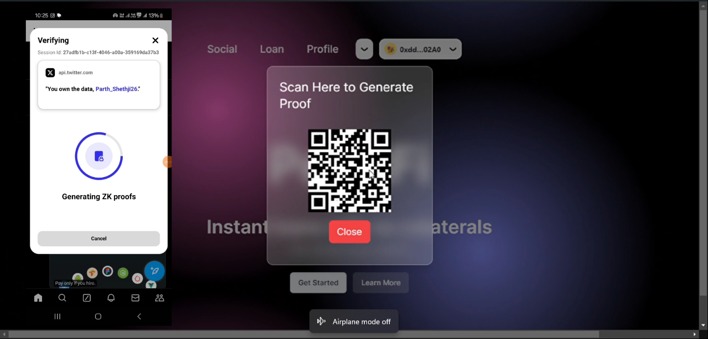

# PeosFi - Instant Uncollateralized Loans

## Table of Contents
- [Problem Statement](#problem-statement)
- [Solution](#solution)
- [Unique Features](#unique-features)
- [Getting Started](#getting-started)
- [Images of Our Product](#images-of-our-product)
- [YouTube Video](#youtube-video)

## Problem Statement
In traditional finance, unsecured borrowing is crucial for business growth, personal projects, and accessible financing. Bringing this concept to the blockchain has been challenging due to the absence of standard credit checks and traditional trust networks, leaving individuals with limited access to capital and few decentralized alternatives.

## Solution
PeosFi is a **SocialFi application** designed to enable **unsecured, uncollateralized loans** on-chain, making decentralized borrowing more accessible. Instead of collateral, PeosFi leverages:
1. **On-Chain History**: Assesses repayment behavior and transaction history.
2. **Social Connections**: Builds credit through trusted networks.
3. **Reputation and Proof of Humaness**: Integrates a new system for verifying real users via **Reclaim Protocol**, ensuring a bot-free environment by confirming users’ past KYC status on platforms like Coinbase or CoinSwitch using **zero-knowledge proofs**.

The platform includes a **dynamic credit line** system, evolving based on users' behavior, social endorsements, and reputation. This approach incentivizes trustworthiness and discourages defaults, while financial parameters adjust to maintain a fair, sustainable lending environment.

## Unique Features
1. **Proof of Humaness**: PeosFi verifies users’ authenticity using **Reclaim Protocol**. This integration ensures users are real humans by leveraging past KYC data from trusted sources, secured with zero-knowledge proofs for privacy.
2. **Social Credit Model**: A user's loan capacity is determined by their on-chain actions, social connections, and past behavior. Users can even request additional funds from trusted friends if their own credit limit is insufficient.
3. **Reputation-Driven Risk Management**: Users are rewarded for connecting with trustworthy peers. Defaulting connections impact the borrower’s reputation, discouraging risky associations.
4. **Sybil-proof**: By validating each user's unique identity and avoiding repeat KYC requirements, PeosFi ensures a trusted user base, free of bots or fraudulent accounts.

## Getting Started
To get started with PeosFi, follow these steps:

### Prerequisites
1. **Install Metamask**: Make sure you have a Web3 wallet installed (e.g., [MetaMask](https://metamask.io/)).
2. **Get Testnet Tokens**: Obtain test tokens for transactions on the supported testnet.

### Installation
1.  **Clone the Repository**:
   ```bash
   git clone https://github.com/your-username/peosfi.git
   cd peosfi
   ```

2. **Install Dependencies**:
   ```bash
    npm install
    ```

3. Add API Keys

<br>

4. **Start the dev Server**
    ```bash
    npm run dev
    ```


### Here are some of the images of our Product 
 


 

 


## Link to our Youtube Video

### https://youtu.be/m41FjtYPVBQ